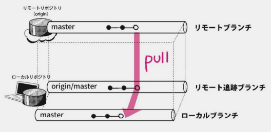
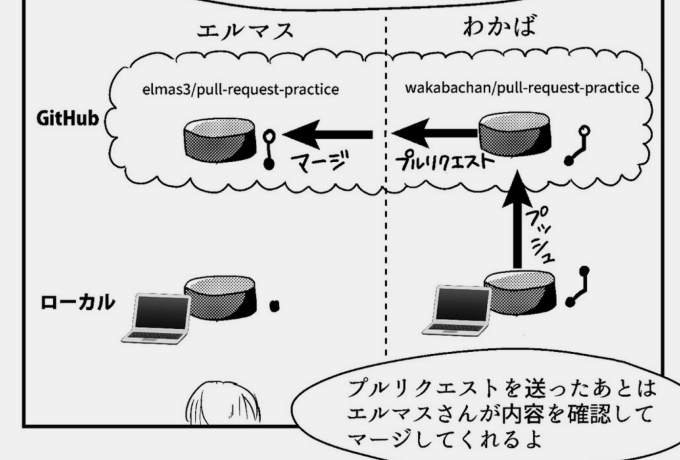

## Githubとは? 

---
### 参考図書
「わかばちゃんと学ぶGit使い方入門」
https://www.amazon.co.jp/dp/B071D4D6XX/ref=cm_sw_em_r_mt_dp_Y5K4REBQPFASPWX7PBPK

---
### Githubとは
- Git(バージョン管理システム)を利用するためのHub
- 文書や画像など、どんな種類のドキュメントでもアップデート履歴を保存し共有・公開できる

---
- ホワイトハウスも業務ソフトのオープンソース化にGithubを利用
- COVID-19含め疫学データセットやオープンソースプロジェクトも公開されている。

---
### バージョン管理システム
- 集中型:変更は中央レポジトリに即時反映。
- 分散型:中央レポジトリを各自クローンして使う。
  

---
### Gitの操作
- CUI: 開発者やエンジニア向き
- GUI: 初心者向き　例）Sourcetree
  - コマンド入力不要。クリックするだけでプッシュ、コミットなどを実行できる
  

---
### 用語の説明

---
### リモートリポジトリ、ローカルレポジトリ、ブランチ

- リモートリポジトリをクローンしたものはデフォルトでoriginと名付けられる。
- masterブランチ（本番用、最新版）
---
### フォーク、クローン

---
### コミット、プッシュ、プル

- プッシュ:コミットをリモートリポジトリに反映（≈アップロード）
- プル:リモートリポジトリの変更をローカルリポジトリに反映（≈ダウンロード）

---
### マージ、コンフリクト

- コンフリクト = 同じ行に、同時に別々の修正が行われたためマージできない状態

---
### プルリクエスト
- リモートリポジトリ(origin)の管理者にプルを依頼すること

---
### ごく簡単なデモ
Sourcetreeを使う予定でしたが、アプリのインストール、Githubとの連携などがうまくいかなかったりするので、
Github上で。

---
### おわり
差分管理は結局どのツールをつかってもめんどう。
今後少しずつ慣れていこうと思います。
