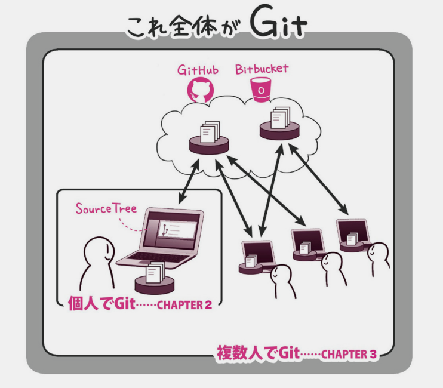

## Githubとは? 
---
### Githubとは
Git(バージョン管理システム)を利用するためのHub
コンピュータプログラムやソースコードの公開・共有・管理に利用されているウェブサービス 

---
### Basic structure of Table 1

- キーとなる変数（少なくともメインの解析に含まれる変数）
- 記述的統計量
- カテゴリカル変数  n(%)
- 連続変数  平均（標準偏差）or 中央値（25～75％タイル or 最小値-最大値）
- 合計欄は外的妥当性の評価に役立つ

---
### Conclusion
差分管理は結局どのツールをつかってもめんどう。
---
### おわり
