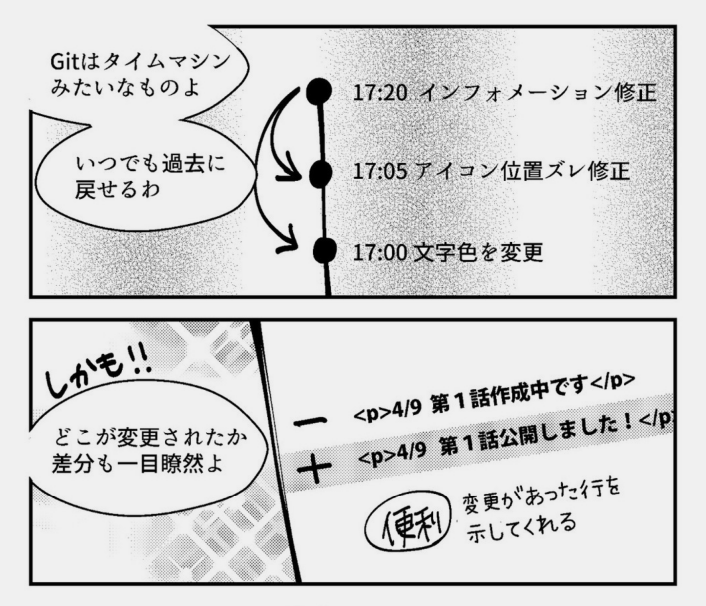
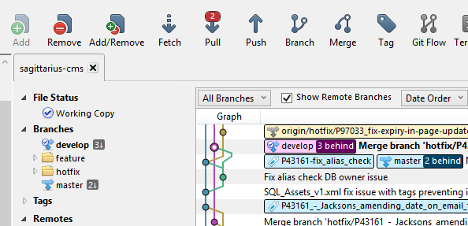
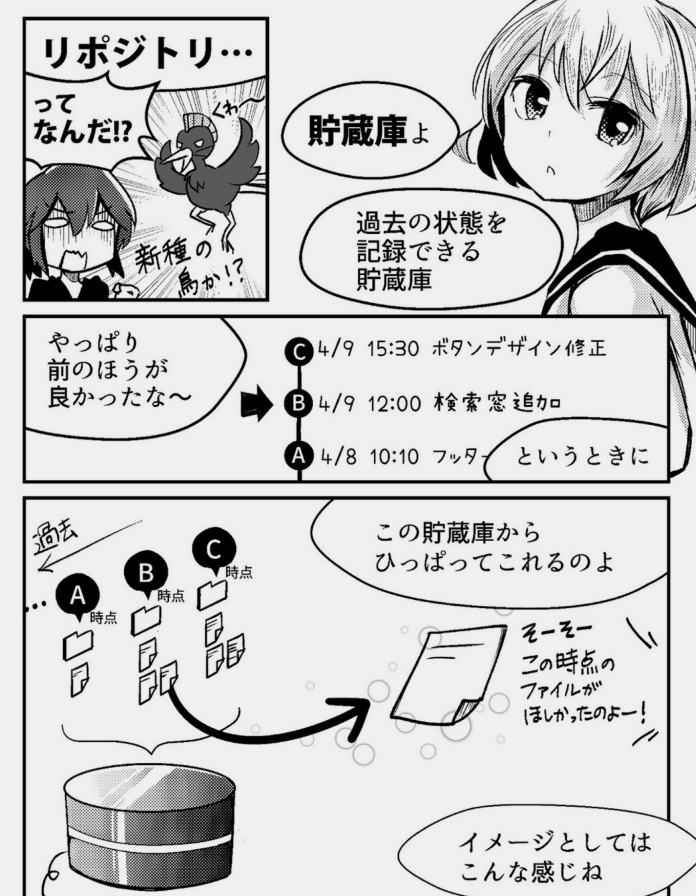
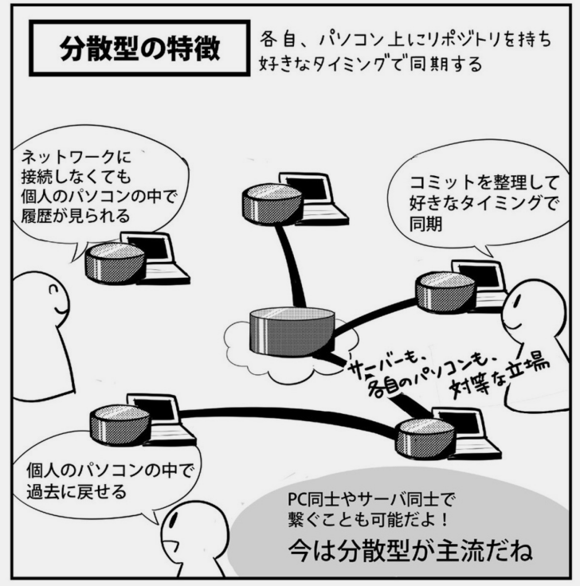
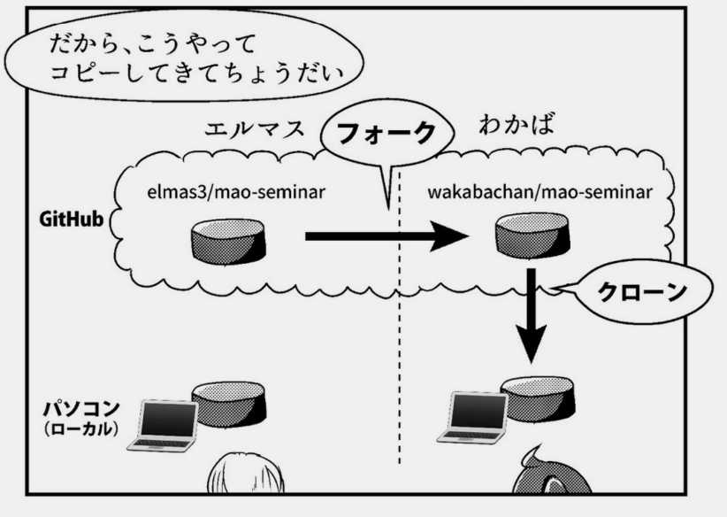
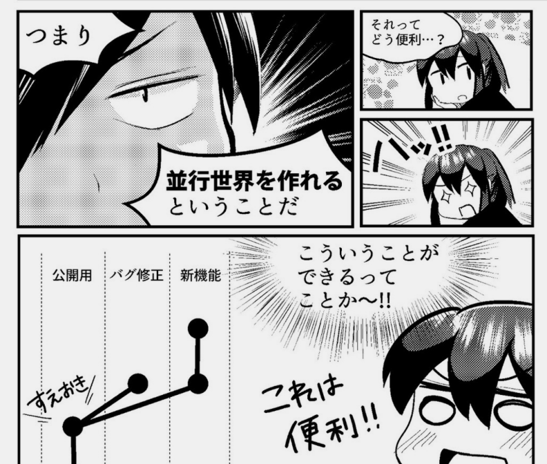

## Githubとは? 
---
### Githubとは
- Git(バージョン管理システム)を利用するためのHub
- 文書や画像など、どんな種類のドキュメントでもアップデート履歴を保存し共有・公開できる

---
- 西アフリカでのエボラ出血熱やCOVID-19などの疫学データセットやオープンソースプロジェクトも公開されている。

---
### Gitの操作
- CUI: 開発者やエンジニア向き
- GUI: 初心者向き　Sourcetreeなど
  - コマンド入力不要 クリックするだけでプッシュ、コミットなどを実行できる
  

  
---
### Git用語1 レポジトリ

---
### Git用語2 コミット、プッシュ、プル

- プッシュ:コミットをリモートリポジトリに反映（≈アップロード）
- プル:リモートリポジトリの変更をローカルリポジトリに反映（≈ダウンロード）

---
### Git用語2 クローン
- バージョン管理システム
  - 集中型　1つのレポジトリに接続してみんなで使う。コミットは即時中央レポジトリに反映。
  - 分散型　中央のレポジトリを、各自のパソコンにクローンして使う。好きなタイミングで同期。

---
### Git用語4 フォーク
- バージョン管理システム
  - 集中型　1つのレポジトリに接続してみんなで使う。コミットは即時中央レポジトリに反映。
  - 分散型　中央のレポジトリを、各自のパソコンにクローンして使う。好きなタイミングで同期。

---
### Git用語4 ブランチ、マージ、コンフリクト
- 同時並行で作業するときに便利
- masterブランチ（本番用、最新版）

- コンフリクト = 同じ行に、同時に別々の修正が行われ、どちらの内容を優先すべきか判断できずマージできない状態

---

### Conclusion
差分管理は結局どのツールをつかってもめんどう。
---
### おわり
